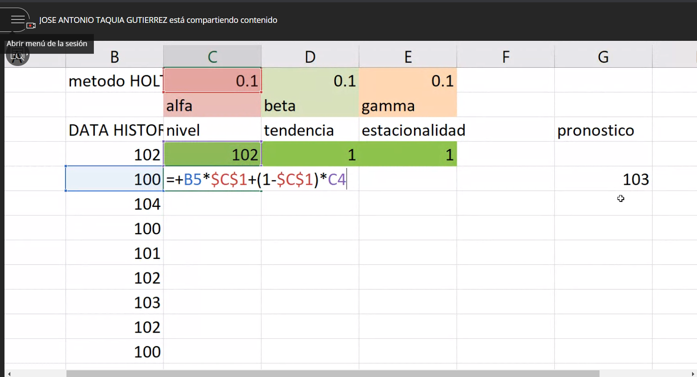
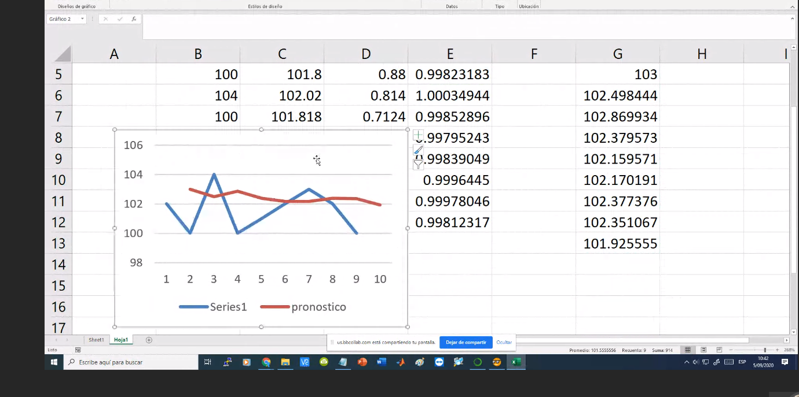
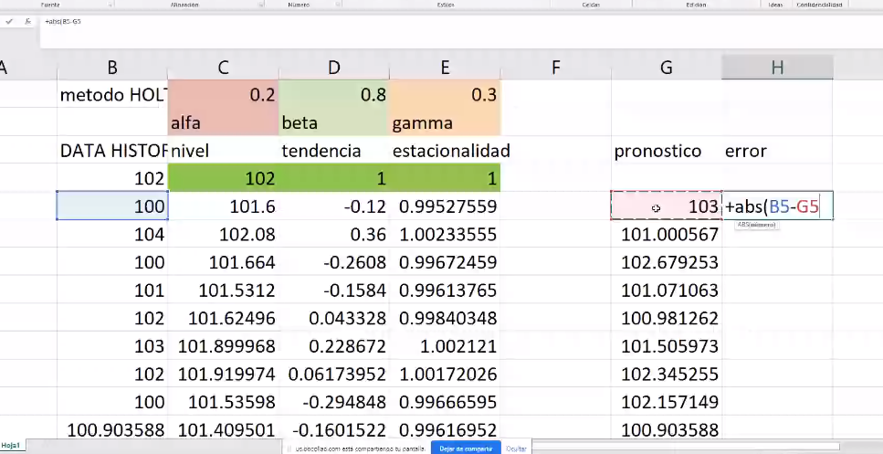
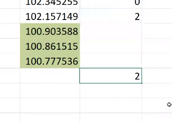
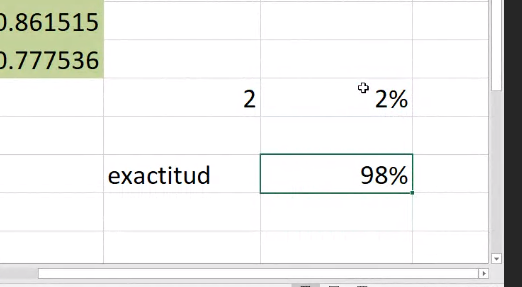

# Importacion de libreria
```{r}
library("TTR")
```

# Lectura de datos y cpnversion a serie de tiempo
```{r}
df = read.csv("./datasets/jat_AIRP2.csv", header=TRUE)

# Conversion a serie de tiempo 
serie1 = ts(df)
```

# Media de promedio movil
Esta tecnica permite que mientras el periodo sea mas largo, haya una atenuacion de los picos. Separar el ruido.

n es la ventana de amplitud

## Ventana de 3
```{r}
timeseries1SMA3 <- SMA(serie1,n=3)
plot(timeseries1SMA3)
```

## Ventana de 8

```{r}
timeseries1SMA8 <- SMA(serie1,n=8)
plot(timeseries1SMA8)
```

# Metodo Holtwinters

Metodo que tiene memoria. 0.1 valor actual y 0.9 valor pasado

Alfa, beta y gamma se cambian los parametros






## Definicion del error en el metodo




El valor actual mas un error de menos mas 2




La exactitud es el complemento



```{r}
#Trabajando solo con el alfa
forecasts <- HoltWinters(serie1, beta=FALSE, gamma=FALSE)
```

```{r}
forecasts
```
```{r}
forecasts$fitted
```
```{r}
plot(forecasts)
```

h es el numero de periodos que vamos a lanzar al futuro

```{r}
library("forecast")
forecasts2 <- forecast(forecasts, h=8) # EL PRONOSTICO TENDRA 8 PERIODOS FUTUROS
plot(forecasts2)
```

```{r}
Box.test(forecasts2$residuals, lag=20, type="Ljung-Box")
```
```{r}
forecasts3<-na.omit(forecasts2$residuals)
acf(forecasts3, lag.max=20)
```

```{r}
plotForecastErrors <- function(forecasterrors)
  {
     # make a histogram of the forecast errors:
     mybinsize <- IQR(forecasterrors)/4
     mysd   <- sd(forecasterrors)
     mymin  <- min(forecasterrors) - mysd*5
     mymax  <- max(forecasterrors) + mysd*3
     # generate normally distributed data with mean 0 and standard deviation mysd
     mynorm <- rnorm(10000, mean=0, sd=mysd)
     mymin2 <- min(mynorm)
     mymax2 <- max(mynorm)
     if (mymin2 < mymin) { mymin <- mymin2 }
     if (mymax2 > mymax) { mymax <- mymax2 }
     # make a red histogram of the forecast errors, with the normally distributed data overlaid:
     mybins <- seq(mymin, mymax, mybinsize)
     hist(forecasterrors, col="red", freq=FALSE, breaks=mybins)
     # freq=FALSE ensures the area under the histogram = 1
     # generate normally distributed data with mean 0 and standard deviation mysd
     myhist <- hist(mynorm, plot=FALSE, breaks=mybins)
     # plot the normal curve as a blue line on top of the histogram of forecast errors:
     points(myhist$mids, myhist$density, type="l", col="blue", lwd=2)
  }

plotForecastErrors(forecasts3)
```
# Segundo ejemplo con todos los parametros
```{r}
timeseries <- ts(serie1, frequency=12, start=c(1946,1))
timeseries_Smooth <- log(timeseries)
forecasts_Smooth <- HoltWinters(timeseries_Smooth)
plot(forecasts_Smooth)
```
```{r}
forecasts_Smooth_future <- forecast(forecasts_Smooth, h=48)
plot(forecasts_Smooth_future)
```

```{r}
forecasts4<-na.omit(forecasts_Smooth_future$residuals)
acf(forecasts4, lag.max=20)
```


```{r}
Box.test(forecasts4, lag=20, type="Ljung-Box")
```


```{r}
plot.ts(forecasts4)
```


```{r}
plotForecastErrors(forecasts4)
```

```{r}
 
  forecasts5_arima <- arima(timeseries, order=c(0,1,1)) # fit an ARIMA(0,1,1) model
  
  forecasts5_arima_forecasts <- forecast(forecasts5_arima, h=5)
  
  
  plot(forecasts5_arima_forecasts)
  
  forecasts6<-na.omit(forecasts5_arima_forecasts$residuals)
  acf(forecasts6, lag.max=20)
  Box.test(forecasts6, lag=20, type="Ljung-Box")
  plot.ts(forecasts6)
  plotForecastErrors(forecasts6)
```
